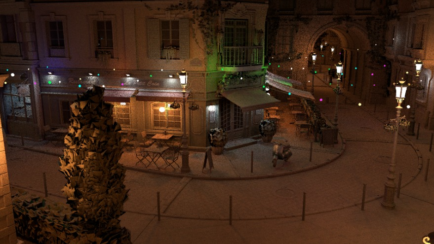

# OptixRenderer
Renderer for real-time rendering research, written in OptiX using OWL for our CVIT research project: 'Real-time Analytic Rendering in the Presence of Many Lights'

- Core LTC code by [Aakash KT](aakashkt.github.io)
- BVH implementation by [Ishaan Shah](ishaanshah.github.io))  


## My contribution
**Stochastic Shadows**, a direct implementation of Heitz et al.'s paper ['Combining Analytic Direct Illumination and Stochastic Shadows'](https://research.nvidia.com/publication/2018-05_combining-analytic-direct-illumination-and-stochastic-shadows)


## Implementation
- `cuda/ltc_testbed.cu`
```cpp
color = estimateDirectLighting(si,rng,2)/estimateDirectUnshadowedLighting(si, rng, 2);
``` 
- `cuda_headers/renderers/direct_noshadows.cuh`
```cpp
vec3f estimateDirectUnshadowedLighting(SurfaceInteraction& si, LCGRand& rng, int type)
```
- `estimateDirectLighting` uses LTCs to estimate direct lighting

## Results

LTC-based direct lighting 


LTC-based direct lighting + Stochastic Shadows (my contribution)


Reference Path-traced image 


## Preliminary Profiling
The total time taken to render currently is about 40-50 ms on a RTX 3090 which gives us about 20 FPS. However, the results are far from ground truth and we need to keep more time in budget for denoising. 

Currently the main issue is somehow not sampling the same lights. We need to find a better way than rejection sampling.


